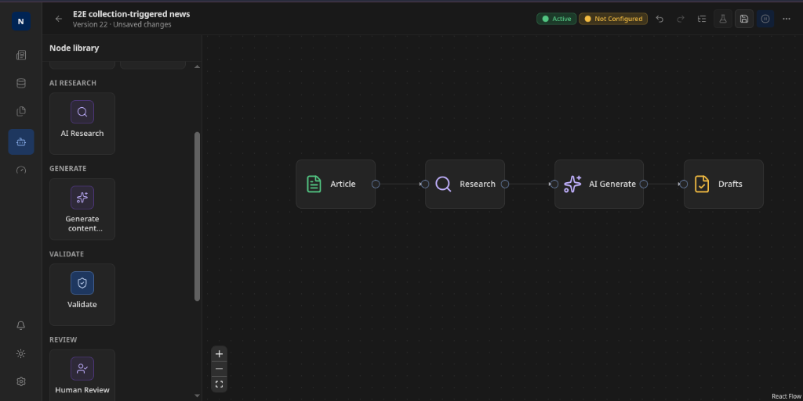
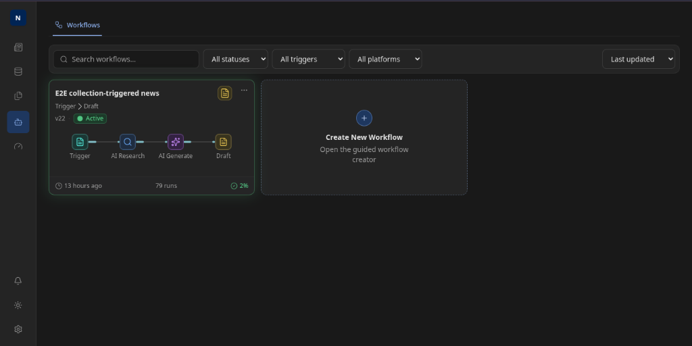
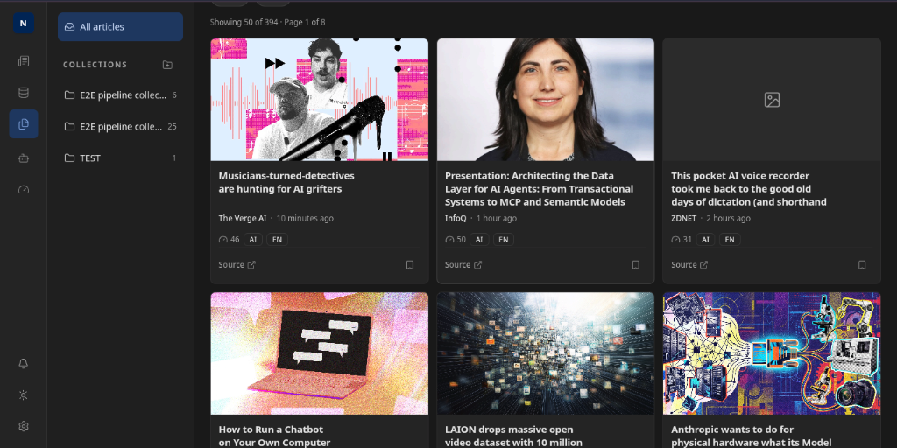
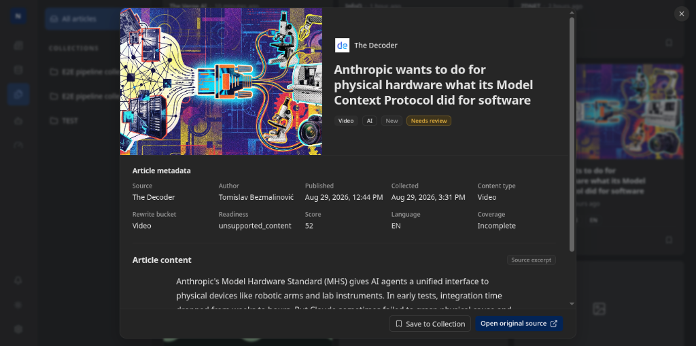
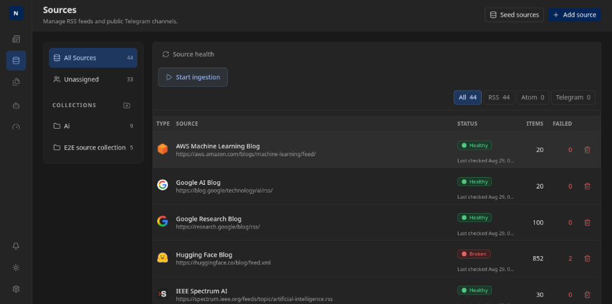
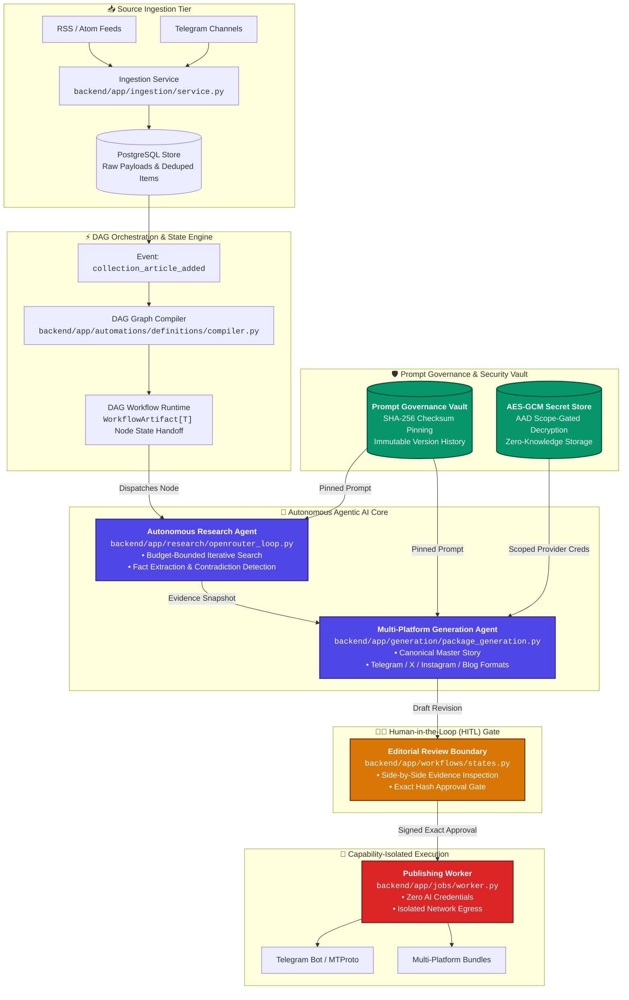

# NewsCraft 🗞️🤖

> **Durable Autonomous Agentic Newsroom & Multi-Platform Editorial Pipeline**  
> *A Production-Grade Architecture MVP Showcasing Robust Multi-Agent Orchestration, Strict Prompt Governance, and Capability-Isolated Execution.*

[](https://foglamp.dev/scan/newscraft-xidxfv)
[-amber?style=flat-square)](#-project-status--mvp-scope)
[](backend/tests/)
[](frontend/tests/)
[](backend/)
[](backend/app/)
[](frontend/)
[](backend/alembic/)

---

## 📌 Interactive Architecture Map

Explore the live, interactive system topology and dataflow graph powered by Foglamp:  
👉 **[View Interactive Architecture Scan on Foglamp](https://foglamp.dev/scan/newscraft-xidxfv)**

---

## 📸 Visual Tour & Photo Library

<div align="center">

### 1. Guided Visual DAG Workflow Builder

*Interactive canvas (XYFlow/React Flow) for authoring deterministic execution plans linking trigger events, budget-bounded AI research agents, structured multi-platform generation, and human editorial review.*

---

### 2. Workflow Automations & Pipeline Management

*Operator dashboard monitoring active DAG pipelines, execution run counts, version history, and real-time trigger bindings.*

---

### 3. Source Intelligence & Unified Article Grid

*Real-time feed of deduplicated, normalized, and scored content items ingested across RSS, Atom, and Telegram channels.*

---

### 4. Human-in-the-Loop (HITL) Evidence & Editorial Inspection

*Deep editorial modal inspecting source provenance, raw excerpts, classification tags, and rewrite readiness prior to agent dispatch.*

---

### 5. Multi-Source Management & Health Diagnostics

*Real-time feed health monitoring with automated status detection, failure counts, and one-click source seeding.*

</div>

---

## 📋 Project Status & MVP Scope

> [!NOTE]
> **NewsCraft is currently an active Architecture Minimum Viable Product (MVP).**
> 
> The core multi-agent DAG orchestrator, prompt governance engine, budget-bounded autonomous research loops, zero-trust capability-isolated worker topologies, and deterministic human-in-the-loop (HITL) editorial gates are **fully implemented, operational, and verified across 2,000+ unit and end-to-end integration tests**.
> 
> Active roadmap development is expanding automated destination connectors (e.g. Instagram/X webhooks), real-time collaborative editorial diffing, and automated LLM-as-a-judge evaluation harnesses.

---

## 🏗️ System Architecture

NewsCraft converts streaming, unstructured multi-source intelligence (RSS/Atom feeds, Telegram channels) into human-verified, multi-platform journalistic publications through a compiled, durable DAG of specialized autonomous agents.



---

## 💎 Key AI Engineering & Architecture Innovations

### 1. Durable DAG Agent Orchestrator with Deterministic State Machine
* **Backend-Owned Graph Compiler (`compiler.py`)**: Workflows created in the visual builder are compiled into directed acyclic execution plans with cycle detection, node-contract validation, and SHA-256 graph-hash verification (`graph_hash_sha256`).
* **Durable Type-Safe Node Handoff (`WorkflowArtifact[T]`)**: Every node transition persists intermediate outputs as typed, immutable artifacts inside PostgreSQL. Worker crashes or network timeouts resume from the last completed node without re-executing expensive upstream LLM calls.
* **Idempotent Job Leasing**: Postgres-backed distributed worker queues lease jobs with heartbeat leases, toxic-job quarantine, and strict retry schedules.

### 2. Autonomous Deep-Research Agent with Budget Guardrails
* **Iterative In-Loop Tool Execution (`openrouter_loop.py`)**: An autonomous agent that recursively evaluates source material, queries search indexes, scrapes evidence documents, and reconciles contradictory claims.
* **Strict Runtime Cost & Hallucination Budgets**: Hard runtime enforcement of:
  * `query_budget` (max external web searches)
  * `page_budget` (max webpage scrapes)
  * `time_budget_seconds` (hard execution ceiling)
* **Structured Fact Extraction (`StoryEvidenceSnapshot`)**: Synthesizes verified claims, confidence scores, extracted citations, and flagged contradictions directly into the database before content generation begins.

### 3. Enterprise Prompt Governance Vault with SHA-256 Pinning
* **Immutable Prompt Versioning (`models.py`)**: All system instructions, formatting guidelines, and brand personas are versioned entities in PostgreSQL (`PromptTemplateVersion`).
* **Cryptographic Checksum Pinning**: Workflows bind to explicit `prompt_checksum_sha256` digests. Upstream prompt edits never cause silent behavioral drift in existing production workflows; runs reject mismatched hashes with explicit `409 Conflict` errors.
* **Structured Output Enforcement**: Pydantic schema validation for cross-platform content packages (canonical story, Telegram HTML with verified formatting rules, Instagram carousels, X threads, and markdown blog posts).

### 4. Zero-Trust Capability-Isolated Worker Topology
* **Physical Isolation of Privileges**:
  * `api` & `scheduler`: Zero knowledge of raw external AI API keys or publishing tokens.
  * `worker-source-generation`: Holds AI provider credentials (`OPENROUTER_API_KEY`) and source ingestion sessions, but has **zero access to publishing secrets**.
  * `worker-publishing`: Holds publishing destination credentials (`TELEGRAM_DESTINATION_NEWS_TOKEN`), but has **no network access or keys for AI models**.
* **AES-256-GCM Secret Vault (`secret_store.py`)**: Master-key-backed envelope encryption with Additional Authenticated Data (AAD) scope gating preventing cross-tenant or unauthorized key retrieval.

### 5. Human-in-the-Loop (HITL) Guardrails
* **Immutable Revision Fencing**: AI agents are strictly prohibited from publishing. Agents can only author `pending_review` revisions.
* **Exact Editorial Approvals**: Editors inspect side-by-side claim citations, edit drafts directly in Next.js, and sign off on exact revision IDs. The publishing engine validates that the published artifact matches the approved revision byte-for-byte.

---

## 🔄 End-to-End Pipeline Walkthrough

```
┌─────────────────┐     ┌─────────────────┐     ┌─────────────────┐     ┌─────────────────┐     ┌─────────────────┐
│ 1. Ingestion    │ ──▶ │ 2. Research     │ ──▶ │ 3. Generation   │ ──▶ │ 4. Editorial    │ ──▶ │ 5. Publication  │
│ RSS / Telegram  │     │ Evidence Loop   │     │ Multi-Platform  │     │ Human Review    │     │ Zero-AI Worker  │
└─────────────────┘     └─────────────────┘     └─────────────────┘     └─────────────────┘     └─────────────────┘
```

1. **Ingestion & Normalization**: Continuous or scheduled fetchers pull raw feeds and messages, deduplicate against existing items using content hashes, extract rich media assets, and normalize metadata.
2. **Autonomous Investigation**: When an article enters a monitored collection, the research agent kicks off. It analyzes the core claims, formulates targeted search queries, pulls context, and compiles an evidence snapshot.
3. **Multi-Format Synthesis**: The generation agent consumes the evidence snapshot and editorial brand profiles to synthesize a canonical story, followed by tailored platform packages (e.g. Telegram post with specific read-time tags, X thread with hook/body/CTA, Instagram caption).
4. **Editorial Inspection (HITL)**: The post appears in the NewsCraft review workspace. An editor reviews source evidence links, inspects contradiction flags, fine-tunes copy, and clicks **Approve**.
5. **Deterministic Dispatch**: The publishing worker picks up the approved job, formats the exact payload for the destination API (or exports a production-ready package), and publishes with full audit logging.

---

## 💻 Tech Stack & Topology

| Layer | Technologies | Key Responsibilities |
|---|---|---|
| **Frontend** | Next.js 16 (App Router), React 19, Tailwind CSS, shadcn/ui, TanStack Query 5, XYFlow | Operator dashboard, visual workflow canvas, real-time editorial review workspace |
| **Backend API** | FastAPI (async), Pydantic v2, SQLAlchemy 2 (asyncpg), Alembic | OpenAPI contract, DAG compiler, prompt governance, secret management |
| **Agent Core** | OpenRouter API / OpenAI-Compatible / Local Codex Adapter | Bounded iterative research loop, multi-platform structured generation |
| **Persistence** | PostgreSQL 16 (JSONB workflow state, vector/evidence store) | Durable workflow state machine, job queue, immutable revisions |
| **Execution** | Leased worker processes, Docker Compose | Capability-isolated background tasks, ingestion engine, publishing worker |

---

## 🗺️ MVP Roadmap & Future Milestones

- [x] **Durable DAG Workflow Compiler & Engine** (topological sort, schema validation, graph-hash pinning)
- [x] **Autonomous Deep-Research Agent** (budget-bounded web tool loops, evidence snapshotting)
- [x] **Multi-Platform Content Package Generation** (Telegram, X, Instagram, Blog)
- [x] **Enterprise Prompt Governance** (versioning, SHA-256 verification, Pydantic schemas)
- [x] **AES-GCM Secret Store & Capability-Isolated Worker Infrastructure**
- [x] **Interactive Architecture Scanner (`.foglamp`)**
- [ ] **Automated Destination Connectors** (direct webhook delivery for X/Twitter & Instagram)
- [ ] **LLM-as-a-Judge Automated Evaluation Suite** (factuality, tone alignment, and style drift metrics)
- [ ] **Multi-Agent Editorial Collaboration** (parallel critique agent providing inline suggestions)

---

## 🚀 Local Development & Deterministic Acceptance

### Prerequisites
- Python `3.14+` with [`uv`](https://github.com/astral-sh/uv)
- Node.js `26+` with `npm 11+`
- Docker & Docker Compose

### 1. Initialize Secrets
Generate a master encryption key for the AES-GCM credential vault:
```bash
umask 077
mkdir -p secrets
openssl rand -base64 32 | tr '+/' '-_' | tr -d '=' > secrets/SECRET_MASTER_KEY
```

### 2. Start Services via Docker Compose
```bash
docker compose build
docker compose up -d postgres
docker compose up api
```

### 3. Run Backend Acceptance & Unit Test Suites
```bash
cd backend
uv sync --locked
uv run pytest -v
```

### 4. Run Frontend Vitest & TypeScript Verification
```bash
cd frontend
npm ci
npm test
npm run typecheck
```

### 5. Execute Deterministic End-to-End Smoke Test
Run the complete zero-credential pipeline smoke test (using deterministic test LLM and synthetic fixture ingestion):
```bash
python scripts/smoke.py \
  --base-url http://127.0.0.1:8000 \
  --provider fake \
  --telegram-mode dry-run \
  --output-dir ./smoke-results
```

---

## 📚 Canonical Architecture Documentation

- 🗺️ **[Interactive Foglamp Architecture Map](https://foglamp.dev/scan/newscraft-xidxfv)**
- 📐 **[System Specification & Data Contracts](docs/architecture/system-spec.md)**
- 🧪 **[Production Readiness & Audit Report](docs/architecture/production-readiness-audit.md)**
- ⚙️ **[Automation Workflows & Prompt Safety](docs/operations/automation-workflows.md)**
- 🔒 **[Credential Topology & Worker Isolation](docs/operations/credential-topology.md)**
- 🔄 **[Release Acceptance & Recovery Runbooks](docs/operations/release-acceptance.md)**

---

## ⚖️ License
NewsCraft is released under the [MIT License](LICENSE).
